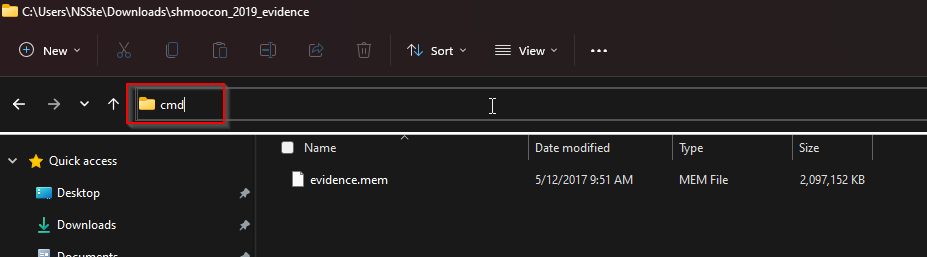
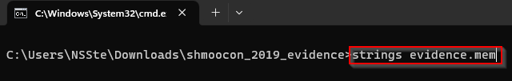
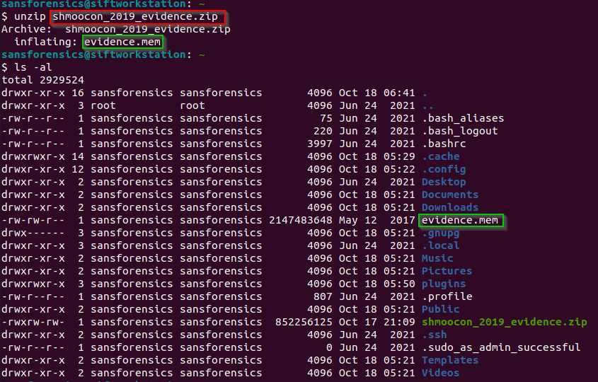
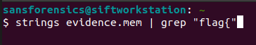

# All Strung Out
- [Windows](#windows)
- [Linux](#linux)

## Windows
1. Download file by clicking on the link
2. Extract file using 7zip(7zip is faster than windows zipping program and can help with large sized files). To do this we right click on the file head down to 7zip then move over and press Extract to 'folder name'. After open the folder by double clicking on it.

3. Open up a terminal - Click on the path of the folder then type cmd, then press enter.

4. Reading over the challange description and title again it seems they want us to find the first time a flag is mentioned in the file. To do this we can get all the strings in the file. (Might need to download strings for [sysinternals](https://learn.microsoft.com/en-us/sysinternals/downloads/strings) and add to path)
```bash 
strings evidence.mem
```

5. There are alot of strings in this file. One solution is to filter it down to the strings we are intrested in. Windows has the function findstr, and we know we are looking for a flag that start with flag{ (Tip: After seeing the flag we can stop the command by pressing ctrl+ c)

6. Flag is found

```bash
flag{th1s_1s_the_flag_1n_the_shell}
```

## Linux
1. Open terminal
2. Download file - Gets the file off the metaCTF severs using the web get command. The url was gotten by right clicking on the file and pressing copy link.
```bash
wget https://static.metaproblems.com/227be1210e147f3368ec2cd54e94d973/shmoocon_2019_evidence.zip
```

3. Extract file & move into directory - the linux command to unzip a file is unzip followed by the file. By default it will extract all files into the same directory, that is what the green boxes show. They also show what file was extracted.
```bash
unzip shmoocon_2019_evidence.zip
```

4. Find Strings
```bash
strings evidence.mem
```


5. There are so many strings that pass throughout the screen that it can be hard to find the one we want. Luckly linux has a command to filter strings. It is called grep, we can pass the output of the previous command into grep by using the pipe |. The grep takes a string to filter for, I choose flag{ because we know the flag format starts with it.
```bash
strings evidence.mem | grep "flag{"
```

6. After running the command we see the flag pop up. We can stop the command by pressing ctrl + c. Then we can highlight the flag and press ctrl + shift + c to copy it.

```bash
flag{th1s_1s_the_flag_1n_the_shell}
```